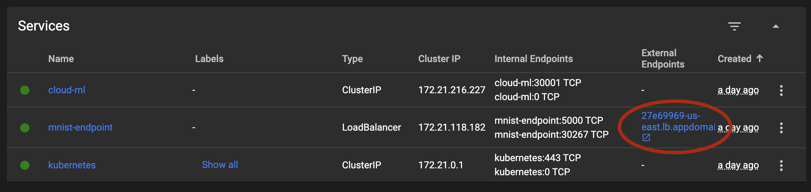

# MNIST Kubernetes Deployment
This is a Flask-based microservice for performing ML tasks such as training and inference on the MNIST dataset.
## Setup & Deployment
### Local
1. Clone the repository and navigate to relevant directory in the `cloud-ml` branch.
    ```shell
    git clone git@github.com:codexceed/MS-CS.git
    cd MS-CS
    git checkout cloud-ml
    cd Courses/Cloud\ ML/Containers/kubernetes
    ```
2. Setup requirements.
    ```shell
    pip install -r requirements.txt
    ```
3. Start the application
    ```shell
    python run.py
    ```
4. Check service status (it runs on `localhost:5001` by default). You should see a response stating "ML Service up".
    ```shell
    curl -X GET http://127.0.0.1:5001/status
    ```

### Kubernetes
After setting up your kubernetes cluster and installing IBM Cloud CLI...
1. Log into IBM Cloud.
    ```shell
    ibmcloud login -a https://cloud.ibm.com -u username -p password
    ```
2. Select the relevant resource group.
    ```shell
    ibmcloud target -g <your-resource-group>
    ```
3. Set your kubectl context.
    ```shell
    ibmcloud ks cluster config -c <your-cluster-id>
    ```
4. Deploy your k8s config.
    ```shell
    kubectl apply -f deployment.yaml
    ```
5. Wait for 30-40 minutes for all services to boot up.
6. Note the external URL on your k8s cluster dashboard:

7. Check service status. You should see a response stating "ML Service up".
    ```shell
    curl -X GET http://27e69969-us-east.lb.appdomain.cloud:5000/status
    ```

## Usage
1. Trigger training on the service. If your connection doesn't timeout, you should see a completion response stating 
   "Training completed!".
   ```shell
   curl -X POST <your-service-url>/train
   Training completed!
   ```
   > **Note**: This may take a long time (~5-10 mins) so you can set a longer connection timeout on `curl` using the 
   > `--connect-timeout` parameter. Regardless of the response, the training will continue in the background.

2. After getting a success response, use the given sample images (or any monochrome 28x28 jpeg image) to infer a 
   classification for the digit on the image. In this case, we're using the file **3.jpg** which is an image of the 
   digit `3`.
   ```shell
   curl -X POST -F file=@data/digit_jpegs/@3.jpg <your-service-url>/classify
   {
     "digit": 3
   }
   ```